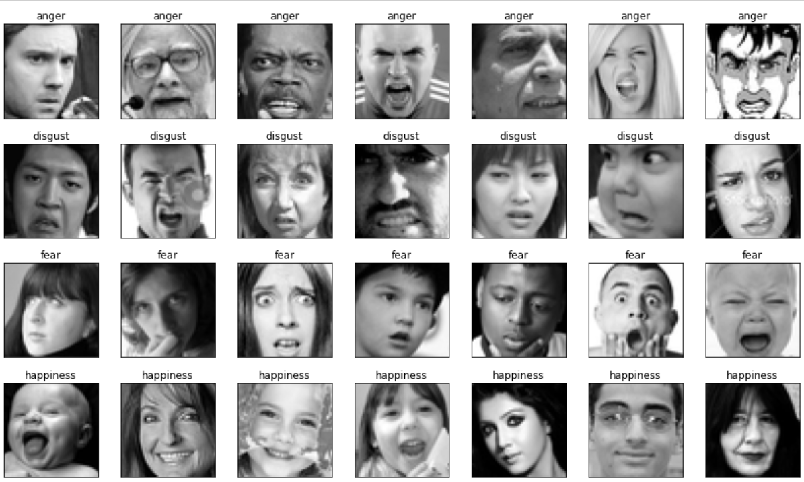
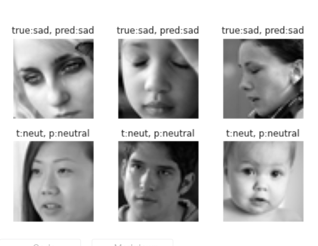

# Facial-Expression-Recognition
A facial emotion/expression recognition model created using CNN with Keras &amp; Tensorflow.\
The model is completely built in python.\
Libraries used :\
math\
numpy\
pandas\
seaborn\
matplotlib\
scikit-learn\
keras\
tensorflow

The dataset can be found at : https://www.kaggle.com/ashishpatel26/facial-expression-recognitionferchallenge \

The dataset looks like:\
 

The output looks like:\
 \

